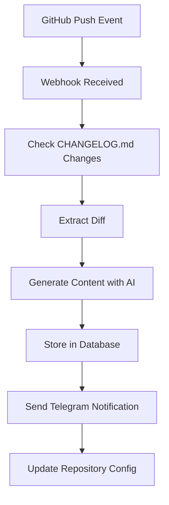

# Negro Industries - GitHub Changelog Automation

An AI-powered system that automatically generates blog posts, social media content, and summaries from GitHub changelog updates. Built with Next.js 15, Supabase, and Groq AI.

## 🚀 Features

- **GitHub Repository Monitoring**: Automatically monitors specified repositories for CHANGELOG.md changes
- **AI-Powered Content Generation**: Uses Groq AI to generate blog posts, social media content, and summaries
- **Telegram Integration**: Sends notifications and generated content via Telegram bot
- **Organization Management**: Supports monitoring entire GitHub organizations
- **Real-time Dashboard**: View all activity, generated content, and system status
- **Webhook Processing**: Handles GitHub webhooks for real-time updates
- **Content Storage**: Automatically saves all generated content to Supabase database
- **Content Management**: Full CRUD operations for generated content via API endpoints
- **Statistics Tracking**: Tracks content generation statistics and repository activity

## 🛠️ Tech Stack

- **Frontend**: Next.js 15 (App Router), React 19, TypeScript
- **Backend**: Next.js API Routes, Supabase (PostgreSQL)
- **AI**: Groq AI (Llama 4 Maverick)
- **Styling**: Tailwind CSS, ShadCN UI
- **Database**: Supabase (PostgreSQL with RLS)
- **Integrations**: GitHub API, Telegram Bot API
- **Deployment**: Vercel

## 📦 Installation

### Prerequisites

- Node.js 18+ or Bun
- GitHub Personal Access Token
- Telegram Bot Token
- Groq AI API Key
- Supabase Project

### Setup

1. **Clone the repository**:
   ```bash
   git clone https://github.com/your-org/negroindustries.com.git
   cd negroindustries.com
   ```

2. **Install dependencies**:
   ```bash
   bun install
   # or
   npm install
   ```

3. **Set up environment variables**:
   ```bash
   cp .env.example .env.local
   ```
   
   Fill in the required environment variables (see [Environment Setup Guide](ENVIRONMENT_SETUP.md))

4. **Set up Supabase database**:
   ```bash
   # Apply database migrations
   npx supabase db push
   ```

5. **Run the development server**:
   ```bash
   bun dev
   # or
   npm run dev
   ```

6. **Open [http://localhost:4000](http://localhost:4000)** in your browser

## 🔧 Configuration

### Environment Variables

Create a `.env.local` file with the following variables:

```bash
# GitHub Configuration
GITHUB_TOKEN=your_github_personal_access_token

# Telegram Bot Configuration
TELEGRAM_BOT_TOKEN=your_telegram_bot_token
TELEGRAM_CHAT_ID=your_telegram_chat_id

# Groq AI Configuration
GROQ_API_KEY=your_groq_api_key

# Supabase Configuration
NEXT_PUBLIC_SUPABASE_URL=your_supabase_project_url
NEXT_PUBLIC_SUPABASE_ANON_KEY=your_supabase_anon_key
SUPABASE_SERVICE_ROLE_KEY=your_supabase_service_role_key

# Site URL
NEXT_PUBLIC_SITE_URL=https://your-domain.com
```

For detailed setup instructions, see the [Environment Setup Guide](ENVIRONMENT_SETUP.md).

### GitHub Webhook Setup

1. Go to your GitHub organization or repository settings
2. Navigate to Webhooks
3. Add a new webhook with:
   - **Payload URL**: `https://your-domain.com/api/github-webhook`
   - **Content type**: `application/json`
   - **Events**: Select "Pushes" and "Repositories"

## 📊 API Endpoints

### Content Management

- `GET /api/content` - Get all generated content with statistics
- `POST /api/content` - Create new content entry
- `GET /api/content/[id]` - Get specific content by ID
- `PUT /api/content/[id]` - Update content by ID
- `DELETE /api/content/[id]` - Delete content by ID
- `GET /api/content/repository/[repository]` - Get content by repository

### Repository Management

- `GET /api/repos` - List monitored repositories
- `POST /api/manage-repos` - Add/remove repositories
- `GET /api/orgs` - List monitored organizations
- `POST /api/manage-orgs` - Add/remove organizations

### Webhooks

- `POST /api/github-webhook` - GitHub webhook handler
- `POST /api/telegram-webhook` - Telegram webhook handler

## 🧪 Testing

### Run Tests

```bash
# Run all tests
bun test
# or
npm test

# Run tests in watch mode
bun test:watch
# or
npm run test:watch

# Run tests with coverage
bun test:coverage
# or
npm run test:coverage
```

### Test Content Storage

```bash
# Test the content storage system
node scripts/test-content-storage.js
```

### Test GitHub Webhook

```bash
# Test GitHub webhook functionality
node scripts/test-webhook.js
```

## 📱 Usage

### Monitoring Repositories

1. **Add Organization**: Use the admin dashboard to add GitHub organizations
2. **Add Individual Repos**: Manually add specific repositories
3. **Configure Webhooks**: Set up GitHub webhooks to trigger on push events

### Content Generation

When a monitored repository has CHANGELOG.md changes:

1. **Webhook Triggered**: GitHub sends a push event
2. **Change Detection**: System detects CHANGELOG.md modifications
3. **AI Generation**: Groq AI generates comprehensive content:
   - Blog post (title, description, body, tags)
   - Social media posts (Twitter, LinkedIn, Facebook)
   - Telegram summary
4. **Storage**: Content is saved to Supabase database
5. **Notification**: Telegram bot sends notification with generated content

### Content Management

- **View Content**: Visit `/content` to see all generated content
- **Copy Content**: Use the built-in copy buttons to copy content for publishing
- **Statistics**: View generation statistics and repository activity
- **Search**: Filter content by repository or date range

## 🏗️ Architecture

### Database Schema

The system uses two main tables:

#### `generated_content`
- Stores all AI-generated content
- Includes blog posts, social media content, and summaries
- Links to repository and commit information
- Tracks generation metadata

#### `activity_logs`
- Stores system activity and events
- Tracks webhook events and processing

### Content Generation Flow



## 🚀 Deployment

### Vercel Deployment

1. **Connect Repository**: Link your GitHub repository to Vercel
2. **Set Environment Variables**: Add all required environment variables in Vercel dashboard
3. **Deploy**: Push to main branch to trigger deployment
4. **Configure Webhooks**: Update GitHub webhook URLs to point to your Vercel deployment

### Database Setup

1. **Create Supabase Project**: Set up a new Supabase project
2. **Apply Migrations**: Run `npx supabase db push` to create tables
3. **Configure RLS**: Row Level Security policies are automatically applied

## 📚 Documentation

- [Environment Setup Guide](ENVIRONMENT_SETUP.md) - Detailed setup instructions
- [Supabase Setup Guide](SUPABASE_SETUP.md) - Database configuration
- [API Documentation](docs/api.md) - Complete API reference
- [Changelog](CHANGELOG.md) - Version history and updates

## 🤝 Contributing

1. Fork the repository
2. Create a feature branch: `git checkout -b feature/amazing-feature`
3. Commit your changes: `git commit -m 'Add amazing feature'`
4. Push to the branch: `git push origin feature/amazing-feature`
5. Open a Pull Request

## 📄 License

This project is licensed under the MIT License - see the [LICENSE](LICENSE) file for details.

## 🙏 Acknowledgments

- [Next.js](https://nextjs.org/) - The React framework
- [Supabase](https://supabase.com/) - Backend as a Service
- [Groq](https://groq.com/) - AI inference
- [Vercel](https://vercel.com/) - Deployment platform
- [ShadCN UI](https://ui.shadcn.com/) - UI components
- [Tailwind CSS](https://tailwindcss.com/) - Styling framework

## 📞 Support

For support, email support@negroindustries.com or create an issue in the GitHub repository.

---

Built with ❤️ by [Negro Industries](https://negroindustries.com)
